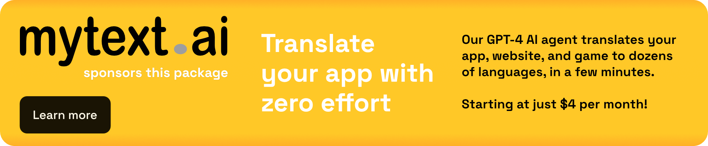
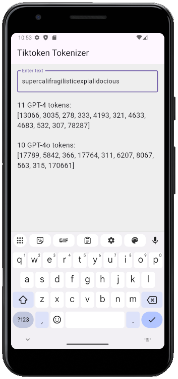

[](https://mytext.ai)

[](https://pub.dev/packages/tiktoken_tokenizer_gpt4o_o1)

# Tiktoken Tokenizer for GPT-4o, GPT-4, and o1 OpenAI models

This is an implementation of the Tiktoken tokeniser,
a [BPE](https://en.wikipedia.org/wiki/Byte_pair_encoding) used by OpenAI's models.
It's a partial Dart port from the original [tiktoken](https://github.com/openai/tiktoken)
library from OpenAI, but with a much nicer API.

**Although there are other tokenizers available on pub.dev, as of November 2024,
none of them support the GPT-4o and o1 model families. This package was created to fill
that gap.**

The supported models are these:

* Gpt-4
* Gpt-4o
* Gpt-4o-mini
* o1
* o1-mini
* o1-preview

Also important, this is a Dart-only package (does not require any platform channels to
work), and the tokenization is done synchronously.

Splitting text strings into tokens is useful because GPT models see text in the form
of tokens. Knowing how many tokens are in a text string can tell you whether:

- Some text is too long for a text model to process.
- How much an OpenAI API call costs (as usage is priced by token).

## Example

To see it in action, run the example app: 



## How to use it

```dart
// Create a Tiktoken instance for the model you want to use.
var tiktoken = Tiktoken(OpenAiModel.gpt_4);

// Encode a text string into tokens.
var encoded = tiktoken.encode("hello world");

// Decode a token string back into text.
var decoded = tiktoken.decode(encoded);

// Count the number of tokens in a text string.
int numberOfTokens = tiktoken.count("hello world");
```

## Advanced use

Alternatively, you can use the static helper functions `getEncoder`
and `getEncoderForModel` to get a `TiktokenEncoder` instance first:

```dart
var encoder = Tiktoken.getEncoder(TiktokenEncodingType.o200k_base);
var encoder = Tiktoken.getEncoderForModel(OpenAiModel.gpt_4o);
```

The `TiktokenEncoder` instance gives you more fine-grained control over the encoding
process, as you now have access to more advanced methods:

```dart
Uint32List encode(
    String text, {
    SpecialTokensSet allowedSpecial = const SpecialTokensSet.empty(),
    SpecialTokensSet disallowedSpecial = const SpecialTokensSet.all(),
  });

Uint32List encodeOrdinary(String text);

(List<int>, Set<List<int>>) encodeWithUnstable(
    String text, {
    SpecialTokensSet allowedSpecial = const SpecialTokensSet.empty(),
    SpecialTokensSet disallowedSpecial = const SpecialTokensSet.all(),
  });
  
int encodeSingleToken(List<int> bytes);

Uint8List decodeBytes(List<int> tokens); 

String decode(List<int> tokens, {bool allowMalformed = true}); 

Uint8List decodeSingleTokenBytes(int token)

List<Uint8List> decodeTokenBytes(List<int> tokens);

int? get eotToken;
```

## Online tokenizer

I've added many tests to make sure this Dart implementation is correct,
but you can also compare yourself the output of this package with the output of the
default implementation, by visiting
the [online Tiktokenizer](https://tiktokenizer.vercel.app/?model=gpt-4o).

## Counting words

What's the relationship between words and tokens?
Every language has a different word-to-token ratio. Here are a few general rules:

* For English: 1 word is about 1.3 tokens
* For Spanish and French: 1 word is about 2 tokens
* How Many Tokens Are Punctuation Marks, Special Characters, and Emojis?
  Each punctuation mark (like ,:;?!) counts as 1 token. Special characters (like ∝√∅°¬)
  range from 1 to 3 tokens, and emojis (like 😁🙂🤩) range from 2 to 3 tokens.

In this package I provide a word counter. Here is how you can use it:

```dart
var wordCounter = WordCounter();

// Prints 0
print(wordCounter.count(''));

// Prints 1
print(wordCounter.count('hello'));

// Prints 2
print(wordCounter.count('hello world!'));
```

Counting words is complex because each language has its own rules for what constitutes a
word. For this reason, the provided word counter is only an approximation and will
give reasonable results only for languages written in the Latin alphabet.

## Credits

This package code was mostly adapted from: https://pub.dev/packages/langchain_tiktoken
from publisher [dragonx.cloud](https://pub.dev/publishers/dragonx.cloud/packages)
/ [website](https://dragonx.cloud/). I've just added more encodings, added tests,
and made the API more user-friendly.

***

<br>By **Marcelo Glasberg**<br>

<a href="https://glasberg.dev">_glasberg.dev_</a>
<br>
<a href="https://github.com/marcglasberg">_github.com/marcglasberg_</a>
<br>
<a href="https://www.linkedin.com/in/marcglasberg/">_linkedin.com/in/marcglasberg/_</a>
<br>
<a href="https://twitter.com/glasbergmarcelo">_twitter.com/glasbergmarcelo_</a>
<br>
<a href="https://stackoverflow.com/users/3411681/marcg">
_stackoverflow.com/users/3411681/marcg_</a>
<br>
<a href="https://medium.com/@marcglasberg">_medium.com/@marcglasberg_</a>
<br>

*The Flutter packages I've authored:*

* <a href="https://pub.dev/packages/async_redux">async_redux</a>
* <a href="https://pub.dev/packages/provider_for_redux">provider_for_redux</a>
* <a href="https://pub.dev/packages/i18n_extension">i18n_extension</a>
* <a href="https://pub.dev/packages/align_positioned">align_positioned</a>
* <a href="https://pub.dev/packages/network_to_file_image">network_to_file_image</a>
* <a href="https://pub.dev/packages/image_pixels">image_pixels</a>
* <a href="https://pub.dev/packages/matrix4_transform">matrix4_transform</a>
* <a href="https://pub.dev/packages/back_button_interceptor">back_button_interceptor</a>
* <a href="https://pub.dev/packages/indexed_list_view">indexed_list_view</a>
* <a href="https://pub.dev/packages/animated_size_and_fade">animated_size_and_fade</a>
* <a href="https://pub.dev/packages/assorted_layout_widgets">assorted_layout_widgets</a>
* <a href="https://pub.dev/packages/weak_map">weak_map</a>
* <a href="https://pub.dev/packages/themed">themed</a>
* <a href="https://pub.dev/packages/bdd_framework">bdd_framework</a>
* <a href="https://pub.dev/packages/tiktoken_tokenizer_gpt4o_o1">
  tiktoken_tokenizer_gpt4o_o1</a>

*My Medium Articles:*

* <a href="https://medium.com/flutter-community/https-medium-com-marcglasberg-async-redux-33ac5e27d5f6">
  Async Redux: Flutter’s non-boilerplate version of Redux</a> 
  (versions: <a href="https://medium.com/flutterando/async-redux-pt-brasil-e783ceb13c43">
  Português</a>)
* <a href="https://medium.com/flutter-community/i18n-extension-flutter-b966f4c65df9">
  i18n_extension</a> 
  (versions: <a href="https://medium.com/flutterando/qual-a-forma-f%C3%A1cil-de-traduzir-seu-app-flutter-para-outros-idiomas-ab5178cf0336">
  Português</a>)
* <a href="https://medium.com/flutter-community/flutter-the-advanced-layout-rule-even-beginners-must-know-edc9516d1a2">
  Flutter: The Advanced Layout Rule Even Beginners Must Know</a> 
  (versions: <a href="https://habr.com/ru/post/500210/">русский</a>)
* <a href="https://medium.com/flutter-community/the-new-way-to-create-themes-in-your-flutter-app-7fdfc4f3df5f">
  The New Way to create Themes in your Flutter App</a> 

*My article in the official Flutter documentation*:

* <a href="https://flutter.dev/docs/development/ui/layout/constraints">Understanding
  constraints</a>
